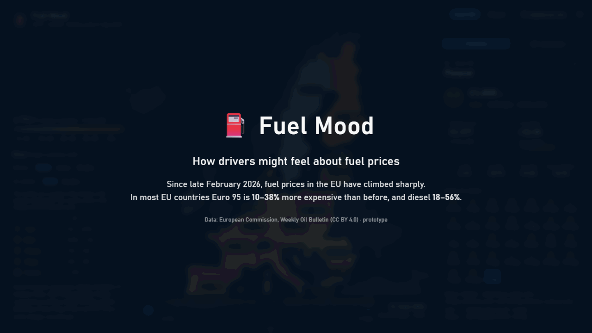

# Fuel Mood ⛽

**Fill up today or wait a week?** A price-mood map of EU-27 fuel prices (Euro 95 and Diesel), built on the European Commission's Weekly Oil Bulletin.



Each Country gets:

- a **mood face** for this week's price change (Delighted → Furious);
- a **thermometer colour** for the change since the February 2026 baseline.

Click a Country to see its price, its week-by-week moods and its price trend against last year. Press ▶ to replay the weeks since February.

## Quick start

You need [Node.js](https://nodejs.org/) 20.19 or newer.

```bash
git clone https://github.com/goreckir/fuel-mood-web.git
cd fuel-mood-web
npm install
npm run dev
```

Open the URL Vite prints (usually http://localhost:5173).

The data is committed in `public/`, so the site works offline. There are no API keys, map tiles or backend.

## Scripts

| Command | What it does |
| --- | --- |
| `npm run dev` | Dev server with hot reload |
| `npm run build` | Type-check and build the static site into `dist/` |
| `npm run preview` | Serve `dist/` locally |
| `npm run lint` / `npm run typecheck` | ESLint / TypeScript checks |
| `npm run data:refresh` | Download the latest Bulletin XLSX and rewrite `public/weather.json` (add `-- --xlsx <file>` to use a local copy) |

## How it works

- **Stack:**
  - Vite, React, TypeScript and Tailwind CSS;
  - the map uses [MapLibre GL JS](https://maplibre.org/) through react-map-gl, with no basemap: only country shapes from Natural Earth.
- **Data:**
  - `public/weather.json` is a snapshot computed by `scripts/refresh-data.mjs` from the EC Weekly Oil Bulletin;
  - a scheduled GitHub Actions workflow refreshes it every Tuesday and redeploys GitHub Pages;
  - why it works this way: [docs/adr/0001-committed-data-snapshot.md](docs/adr/0001-committed-data-snapshot.md).
- **Terms:** Weather, Heat, Baseline price and the other terms are defined in [CONTEXT.md](CONTEXT.md).

Prices are national weekly averages including taxes, not live pump prices.

## Deploying to GitHub Pages

The workflow in `.github/workflows/pages.yml` lints, type-checks, builds (with `BASE_PATH=/<repo>/`) and deploys on every push to `main`.

In a fork, go to **Settings → Pages → Source** and choose **GitHub Actions**.

## Credits

- Source: European Commission, Weekly Oil Bulletin. © European Union, 2005–2026, [CC BY 4.0](https://creativecommons.org/licenses/by/4.0/). Changes computed by Fuel Mood.
- Made with [Natural Earth](https://www.naturalearthdata.com/).
- Mood faces: [Fluent Emoji](https://github.com/microsoft/fluentui-emoji) © Microsoft, MIT.

Details are in [NOTICE](NOTICE).

## Licence

The code is under the [MIT licence](LICENSE). The data and assets keep their own licences (see above).
